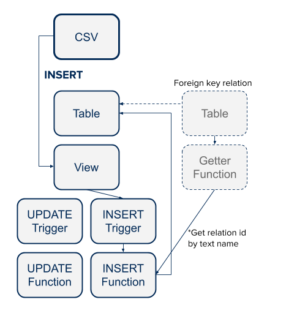

# PGDM General Concepts

 - Keep spreadsheets as ‘source of truth’
 - Provides database level relation between sheets and database rows
 - Prevent duplicate sheet INSERTs
 - Mechanism sheet updates & replacements

How is this done?  PGDM leverages views that are generated to have the same structure as the input datasheets.  Then triggers are associated with the view to preform the actual INSERT, UPDATE or DELETE operation on the table.

Getter functions are created to find foreign key identifiers and provide custom error messages if a row in a foreign key relation can't be found.

